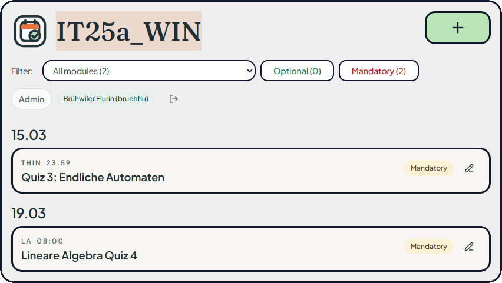

<p align="center">
  
</p>

<p align="center">
  <a href="https://studue.ch">studue.ch</a>
</p>

<p align="center">
  
</p>

## Overview

Studue is a lightweight assignment tracker for the IT25a_WIN class.

- React + Vite frontend
- Java 21 backend with the standard library only
- GitHub Enterprise OAuth via `github.zhaw.ch`
- JSON file storage for assignments, logs, and access control

## Deployment Artifacts

The GitHub Actions build on `main` uploads three artifacts:

- `frontend-dist` with the static frontend files
- `backend-build` with the backend distribution archives and jars
- `deploy-script` with `scripts/deploy-artifacts.sh`

Typical server-side flow:

```bash
gh run download <run-id> -R FlurinBruehwiler/studue
chmod +x deploy-artifacts/deploy-artifacts.sh
sudo ./deploy-artifacts/deploy-artifacts.sh
sudo systemctl restart studue
sudo systemctl reload caddy
```

Default deployment locations used by the script:

- frontend: `/var/www/studue`
- backend releases: `/opt/studue/releases`
- current backend symlink: `/opt/studue/current`
- persistent data: `/var/lib/studue/data`

You can override paths with environment variables such as `WWW_ROOT`, `RELEASES_DIR`, `CURRENT_LINK`, `DATA_DIR`, `FRONTEND_ARTIFACT_DIR`, and `BACKEND_ARTIFACT_DIR`.
